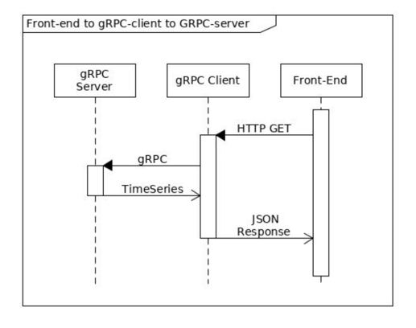

# Timeseries test-app

Test app that shows a possible implementation of a service that
reads time series data.

### App architecture high level overview


User uses a simple form to request data over http. Http server processes request
and query data from a backend server using gRPC.

### Design decisions and what have been done
The service is obviously read heavy. A malicious user could abuse a system by fetching all records from it.
Hence, we allow reading data using iterator approach. A user have to pass `start` and `end` dates to slice the result,
and we also apply a page limit (in our case 512 rows) in case someone will pass a broad range.

Since data contains only a timestamp and a value it is convenient to store it in RDMS (like Postgres) since we might
want to perform different queries and aggregations on it.

What have been done:
1) Simple form to submit request
2) HTTP backend that processes queries from user and pass them down to gRPC service.
3) gRPC server that fetches data from a DB.
4) Tests
5) Data loader module that loads data from file to DB (utils)

### Execution
To launch app use must have `sbt` 
To launch tests that require postgres ensure you have a `docker` daemon running in the background.

Use `sbt test` to launch the tests.

You can launch the application with the following command.

```
sbt "runMain timeseries.ManagedDocker" // docker container will be created automatically
sbt "runMain timeseries.ProvidedDocker" // you should run `docker-compose up -d` first
sbt "runMain timeseries.Stub" // runs with dummy repository layer
```

Things to improve:
1) We could divide our data into partitions. A straight forward way to do it, is to have partition by a range of
   timestamps. This unfortunately could result in non-uniformly distributed data across our partitions. 
   It would be better to use our primary key (serial) and use some hash function to determine to which partition
   we should place our data.
2) Metrics and logging. We could track how ofter certain ranges are queried
3) Put an app in container.